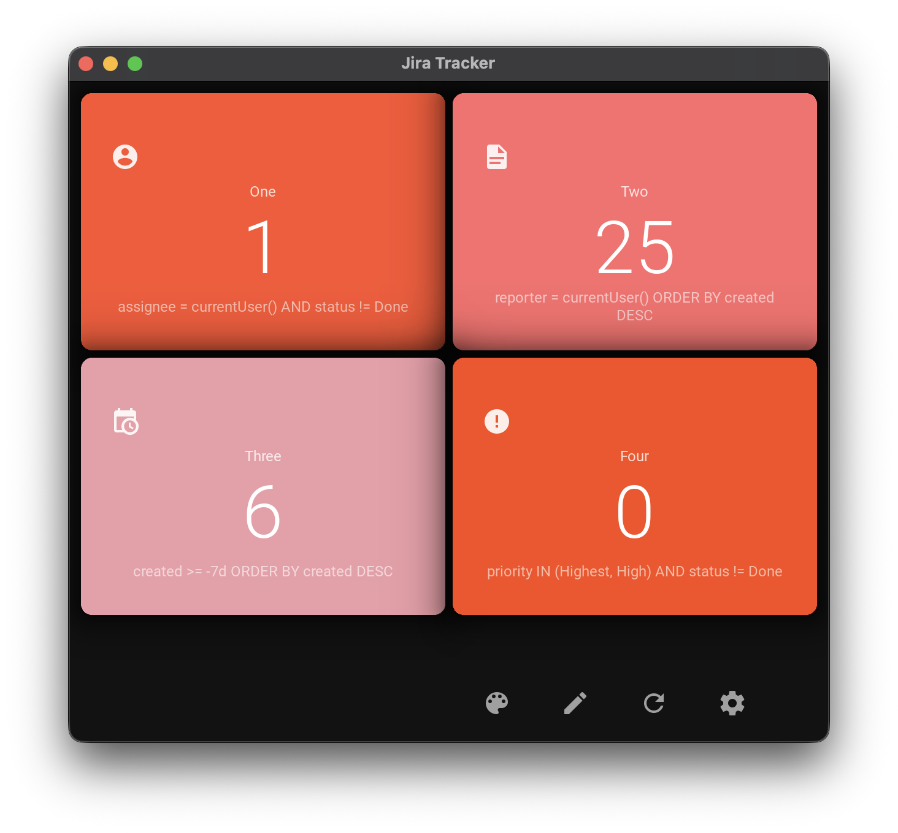

# Jira Issue Tracker

[](https://codecov.io/gh/star7js/jira-issue-tracker)



A lightweight desktop widget for tracking Jira issues at a glance. Monitor critical tasks without switching to your browser.

## Why This Tool?

Stop context-switching between browser tabs to check Jira. This desktop app:
- **Always visible**: Sits on your desktop like a sticky note
- **Beautiful UI**: Modern gradient cards with 5 stunning themes
- **Auto-refreshes**: Updates every hour automatically
- **Customizable**: Track exactly what matters with JQL queries
- **Fast**: Click to open any issue in your browser instantly
- **Private**: Direct API connection, no third-party services

Perfect for developers, project managers, and support engineers who need real-time visibility into their Jira workspace.

## Features

- **Modern Gradient UI**: Beautiful gradient cards with smooth hover effects
- **Theme Cycling**: 5 stunning themes (Default, Ocean, Sunset, Forest, Nord)
- **Custom JQL Queries**: Track up to 4 different queries simultaneously
- **Auto-Refresh**: Updates every hour, no manual refresh needed
- **One-Click Navigation**: Click any issue box to open in browser
- **Custom App Icon**: Professional icon with Jira-themed design
- **Secure**: Direct API connection with retry logic and error handling
- **Universal Support**: Works with Jira Cloud, Server, and Data Center

## Platform Support

- ✅ **Windows** 10/11
- ✅ **macOS** 10.15+
- ✅ **Linux** (Ubuntu, Fedora, Arch)

## Installation

**Requirements:** Python 3.9+

### From PyPI (Recommended)
```bash
pip install jira-issue-tracker
jira-tracker
```

### From Source
```bash
git clone https://github.com/star7js/jira-issue-tracker.git
cd jira-issue-tracker
pip install -e .
python run.py
```

## Quick Setup

### Interactive Setup (Easiest)
```bash
python setup_interactive.py
```

Follow the prompts to configure your Jira connection.

### Manual Setup

1. Copy `example.env` to `.env`
2. Get your API token:
   - **Jira Cloud**: Visit [API Tokens](https://id.atlassian.com/manage-profile/security/api-tokens)
   - **Jira Server/Data Center**: Follow your organization's process
3. Edit `.env` with your credentials:
   - **For Jira Cloud**: Set `JIRA_SITE_URL`, `JIRA_EMAIL`, and `JIRA_API_TOKEN`
   - **For Server/Data Center**: Set `JIRA_SITE_URL` and `JIRA_API_TOKEN` only

```env
# Your Jira URL (include https://)
JIRA_SITE_URL=https://yourcompany.atlassian.net

# Your email (REQUIRED for Jira Cloud only, leave empty for Server/Data Center)
JIRA_EMAIL=your.email@company.com

# Your API token (NOT your password!)
JIRA_API_TOKEN=your_token_here

# Optional: Customize your queries
JQL_QUERY_ONE=assignee = currentUser() AND status != Done
JQL_QUERY_TWO=project = MYPROJECT AND priority = High
JQL_QUERY_THREE=created >= -7d ORDER BY created DESC
JQL_QUERY_FOUR=reporter = currentUser()

# Optional: Set your preferred theme (Default, Ocean, Sunset, Forest, Nord)
THEME_PREFERENCE=Default
```

## Deployment Types

| Type | Example URL | Authentication |
|------|-------------|----------------|
| Jira Cloud | `https://yourcompany.atlassian.net` | Email + API Token |
| Jira Server | `https://jira.yourcompany.com` | API Token only |
| Jira Data Center | `https://yourcompany.com/jira` | API Token only |

**Note:** Jira Cloud requires both your email and API token for authentication. Server/Data Center only needs the API token.

## JQL Query Examples

Track what matters most to you:

| Use Case | JQL Query |
|----------|-----------|
| My open tasks | `assignee = currentUser() AND status != Done` |
| Team blockers | `project = MYPROJECT AND status = Blocked` |
| Recent bugs | `type = Bug AND created >= -7d ORDER BY created DESC` |
| High priority | `priority IN (Highest, High) AND status != Done` |
| My reports | `reporter = currentUser() ORDER BY created DESC` |
| Sprint issues | `sprint in openSprints()` |

[Full JQL Documentation](https://support.atlassian.com/jira-software-cloud/docs/use-advanced-search-with-jira-query-language-jql/)

## Usage

Launch the tracker:
```bash
# If installed via pip
jira-tracker

# Or from source
python main.py
```

**First Run:** If `.env` isn't configured, you'll be prompted to set up your connection.

**Controls:**
- **Click any card**: Open issues in browser
- **Palette icon** (🎨): Cycle through 5 beautiful themes
- **Pencil icon** (✏️): Edit your JQL queries
- **Refresh icon** (🔄): Manually refresh issue counts
- **Settings icon** (⚙️): Configure Jira connection
- **Auto-refresh**: Updates every hour automatically

## Compared To...

| Feature | Browser Tabs | Desktop Notifications | This Tool |
|---------|-------------|----------------------|-----------|
| Always visible | ❌ | ⚠️ Temporary | ✅ Persistent |
| Multiple queries | ❌ Manual | ❌ | ✅ Auto-refresh |
| Low CPU usage | ❌ Heavy | ✅ | ✅ Lightweight |
| Custom JQL | ✅ | ❌ | ✅ Full support |
| Offline mode | ❌ | ❌ | ⚠️ Shows last data |

## Development

```bash
# Install with dev dependencies
pip install -e ".[dev]"

# Run tests
pytest

# Run with coverage
pytest --cov=. --cov-report=html --cov-report=term-missing

# Format code
black .

# Project structure
├── main.py                              # Entry point
├── jira_issue_tracker.py               # Main app logic
├── api.py                              # Jira API wrapper
├── issue_box.py                        # Issue display widget (gradient cards)
├── jira_connection_settings_popup.py   # Configuration UI
├── icon.png                            # Custom app icon
└── tests/                              # Test suite
```

## Troubleshooting

| Issue | Solution |
|-------|----------|
| "Key JIRA_SITE_URL not found" | Run `python setup_interactive.py` or copy `example.env` to `.env` |
| "Unable to connect" | Verify URL includes `https://` and is accessible in browser |
| "Authentication failed" | Regenerate API token - use token, NOT password |
| "No issues found" | Test your JQL query directly in Jira to verify it works |
| Issues not updating | Check network connection, app auto-refreshes every hour |
| KivyMD warnings in console | Safe to ignore - doesn't affect functionality |
| Blank screen on start | Ensure `.env` is configured correctly |

## Roadmap

- [ ] Configurable refresh interval
- [ ] Desktop notifications for new issues
- [ ] Issue quick actions (comment, transition)
- [ ] Multiple workspaces support
- [ ] System tray mode

## License

MIT License

## Built With

- [Kivy](https://kivy.org/) - Cross-platform Python framework
- [KivyMD](https://kivymd.readthedocs.io/) - Material Design components
- [Jira REST API](https://developer.atlassian.com/cloud/jira/platform/rest/v3/) - Jira integration
